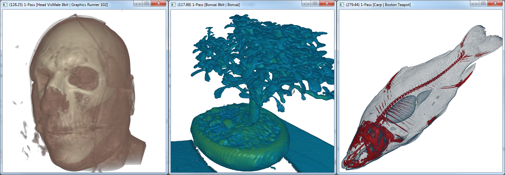

## Volume Rendering GLSL

---

1pass Volume Rendering Application for Structured Volumes (8/16 bits), based on *Kyle Hayward* 2pass Volume Rendering Tutorial from Graphics Runner ([Tutorial101](http://graphicsrunner.blogspot.com/2009/01/volume-rendering-101.html), [Tutorial102](http://graphicsrunner.blogspot.com/2009/01/volume-rendering-102-transfer-functions.html)).

### Project settings

---

* Requires glew, freeglut and glm

* Based on OpenGL 4.x

* Support raw/pvm files

	* raw files contains their settings in the name

* Support gradient lighting (blinn-phong illumination), computed by:

	* Sobel Feldman
	
	* First Derivative

### Transfer function files configurations

---

```bash
".tf1d"
interpolation_mode
configuration_line
rgb_num_points
r g b rgb_scalar_value0
r g b rgb_scalar_value1
...
r g b rgb_scalar_valueN
alpha_num_points
a alpha_scalar_value0
a alpha_scalar_value1
...
a alpha_scalar_valueN
```

### TODO

---

* 2pass volume rendering

* Compute shader to compute gradients

### Screenshots

---


